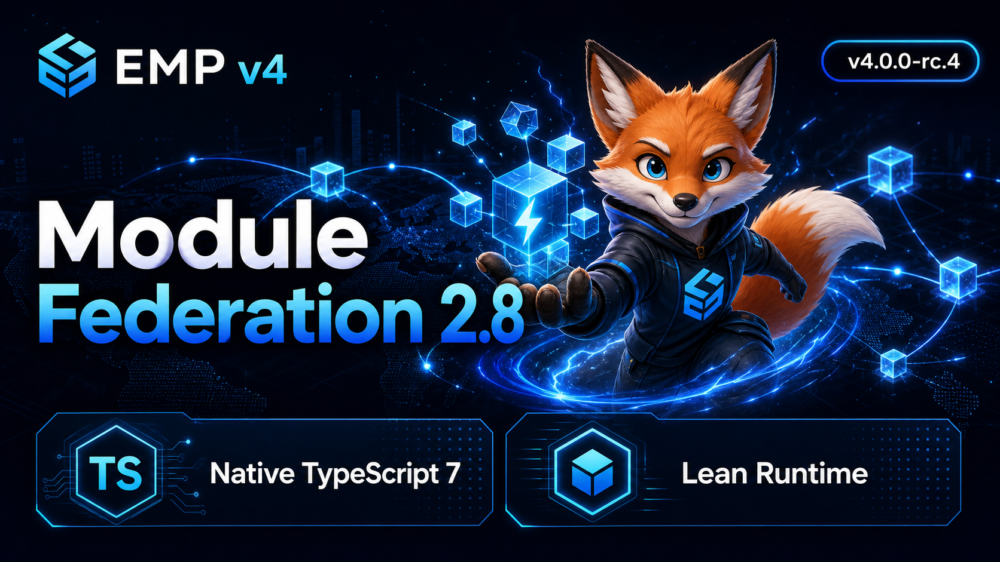

# Changelog

## 4.0.0-rc.4 - 2026-07-15

### Highlights

- Upgrade EMP's Module Federation integration to `2.8.0`, including optional runtime capabilities, a slimmer dependency surface, and Node.js 24 LTS-ready upstream support.
- Remove the temporary `typescript-mf@5.9.3` compatibility alias and the patched Module Federation DTS plugin; declaration generation now resolves the workspace's native TypeScript 7 runtime.
- Keep the unified EMP v4 release line on npm's `rc` dist-tag across all 17 core `@empjs/*` packages.

### What's Changed

#### Build

- chore(module-federation): align `@module-federation/rspack`, `runtime`, `runtime-tools`, and `sdk` to `^2.8.0`.
- chore(toolchain): use Module Federation 2.8's native TypeScript 7 peer contract and remove the TS5-only compatibility dependency and patch.

#### Document

- docs(release): add the EMP Federation Fox release cover for Module Federation 2.8 and native TypeScript 7.

### Verification

- `corepack pnpm test:toolchain`
- `corepack pnpm test:ts7:packages`
- `corepack pnpm release:check`
- `corepack pnpm release:publish:dry -- --skip-build --force-all --tag rc`
- `corepack pnpm ci:verify`
- `corepack pnpm empbuild`
- `git diff --check`

#### Release Cover

#### Full Changelog

- Pending GitHub release compare for `4.0.0-rc.4`.

## 4.0.0-rc.3 - 2026-07-15

### Highlights

- Prepare the EMP v4 `4.0.0-rc.3` release candidate as the stable-ready migration line; packages remain on the `rc` dist-tag until stable promotion.
- Update generated projects and unsupported-command guidance so new consumers do not receive obsolete alpha-era messaging.
- Carry the rc.2 follow-up work into the release contract: Rspack ecosystem alignment, the Agent-First v4 website, repository agent workflow hardening, and the CI website lockfile repair.

### What's Changed

#### Build

- chore(toolchain): update the Rspack ecosystem dependency set and retain the locked workspace resolution for release verification.
- chore(ci): synchronize the website lockfile so clean CI installs use the committed dependency graph.

#### New Features

- feat(website): launch the Agent-First EMP v4 landing page and publish the accompanying EMP skill entry.

#### Document

- docs(migration): mark the v4 migration path stable-ready for rc.3, with explicit `@rc` installation and stable-promotion guidance.
- docs(release): prepare dynamic prerelease/stable changelog wording instead of hard-coding a beta release label.

#### Workflow

- chore(workflow): streamline repository agent routing, context controls, and workflow checks for the v4 release branch.

#### Tests

- test(cli): cover unsupported commands without asserting an obsolete alpha-stage message.
- test(release): verify generated changelog entries describe prerelease and stable versions correctly.

### Verification Plan

- `corepack pnpm --filter @empjs/cli build && corepack pnpm --filter @empjs/cli exec rstest run test/real/cli-command-runtime.test.ts`
- `corepack pnpm test:rules`
- `corepack pnpm release:check`
- `git diff --check`

#### Full Changelog

- Pending GitHub release compare for `4.0.0-rc.3`.

## 4.0.0-rc.2 - 2026-07-09

### Highlights

- Publish EMP v4 rc packages to the npm `rc` dist-tag from the root `4.0.0-rc.2` release line.
- Adopt selected Rspack 2.1 defaults in generated configs: `module.parser.javascript.createRequire` and persistent-cache cleanup.
- Expose higher-risk Rspack 2.1 features as explicit opt-ins: `build.rspack.experiments.sourceImport` and `circularCheckRspackPlugin`.
- Document the Agent-First React Compiler policy: agents may recommend it, but projects must opt in explicitly.
- Ship the Rspress v2 official site as a bilingual Agent-First documentation surface with Chinese default routes and English `/en/` routes.

### What's Changed

#### New Features

- feat(cli): enable `module.parser.javascript.createRequire` by default while keeping `build.rspack.parser.javascript.createRequire` overridable.
- feat(cli): set default persistent cache cleanup to `maxAge: 7 * 24 * 60 * 60` and `maxVersions: 3`, with project cache config taking precedence.
- feat(cli): expose `build.rspack.experiments.sourceImport` as a manual opt-in for source phase imports.
- feat(cli): add the `circularCheckRspackPlugin` config switch for Rspack's built-in circular dependency check plugin, defaulting to disabled.
- feat(plugin-react): document manual React Compiler opt-in for React 19 and React 17/18 target/runtime adoption.

#### Build

- chore(release): align the root workspace and 17 core `@empjs/*` packages to `4.0.0-rc.2`.
- chore(release): exclude `apps/**`, `website`, `@empjs/cdn-*`, and `@empjs/lib-*` from the unified release set.

#### Document

- docs(config): document the Rspack 2.1 default-enabled and manual opt-in behavior in the build config guide.
- docs(skill): add Agent-First React Compiler decision rules, Module Federation cautions, and validation commands.
- docs(website): rebuild the Rspress v2 site with bilingual navigation, Federation Fox homepage styling, and apps acceptance matrix coverage.

#### Tests

- test(cli): assert Rspack 2.1 config defaults, cache override behavior, `sourceImport` passthrough, and `CircularCheckRspackPlugin` injection.

### Verification

- `corepack pnpm --filter @empjs/cli build`
- `node packages/cli/test/rspack2-features-shape.test.mjs`
- `node packages/cli/test/rspack-config-shape.test.mjs`
- `corepack pnpm test:cli`
- `corepack pnpm release:check`
- `node scripts/release.mjs publish --dry-run --skip-build --force-all --tag rc`
- `python3 /Users/Bigo/.codex/skills/.system/skill-creator/scripts/quick_validate.py skills/emp`
- `corepack pnpm ci:verify`
- `corepack pnpm workflow:check`
- `corepack pnpm empbuild`
- `corepack pnpm --dir website build`
- `git diff --check`

#### Full Changelog

- Pending GitHub release compare for `4.0.0-rc.2`.

## 4.0.0-rc.1 - 2026-07-06

### Highlights

- Publish EMP v4 rc packages to the npm `rc` dist-tag from the root `4.0.0-rc.1` release line.
- Align README badges and current-version copy with the npm `@empjs/cli@rc` and `@empjs/share@rc` manifests.
- Switch the GitHub repository default branch to `v4` so README metadata and incoming development target the v4 line by default.

### What's Changed

#### Build

- chore(release): publish the 17 internal core `@empjs/*` packages selected by `release:check` with dist-tag `rc`.
- chore(release): keep `apps/**`, `website`, `@empjs/cdn-*`, and `@empjs/lib-*` outside the unified rc release set.

#### Document

- docs(readme): read the current v4 version, Rspack dependency, Module Federation dependency, Node engine, and license badges from npm `rc` manifests.
- docs(changelog): document the rc.1 release scope, validation commands, and repository default-branch switch.

#### Tests

- test(cli): reserve available local ports in the create-flow port fallback test instead of assuming port 3000 is free on developer machines.

### Verification

- `corepack pnpm workflow:check`
- `corepack pnpm release:check`
- `corepack pnpm release:publish:dry -- --force-all --skip-build --tag rc`
- `corepack pnpm ci:verify`
- `corepack pnpm empbuild`
- `corepack pnpm apps:acceptance`
- `git diff --check`

#### Full Changelog

- Pending GitHub release compare for `4.0.0-rc.1`.

## 4.0.0-beta.2 - 2026-06-30

### Highlights

- Upgrade the EMP CLI Rspack runtime to `@rspack/core@2.1.1` while keeping `@rspack/dev-server@2.1.0`, because `2.1.0` is still the latest dev-server release.
- Upgrade opt-in Rsdoctor integration to `@rsdoctor/rspack-plugin@1.5.17`.
- Review Rspack v2.1.1 release changes against EMP defaults and keep risky optimizations behind existing explicit config.

### What's Changed

#### Bug Fixes

- fix(cli): pick up the Rspack v2.1.1 CSS runtime `link.parentNode` guard and the CJS export assignment side-effect rollback.

#### Build

- chore(cli): resolve the CLI direct Rspack dependency to `@rspack/core@2.1.1`.
- chore(cli): resolve the CLI Rsdoctor plugin dependency to `@rsdoctor/rspack-plugin@1.5.17`.

#### Tests

- test(cli): assert the exported Rspack runtime version is `2.1.1`.
- test(cli): add a real `--doctor` config smoke test that verifies Rsdoctor plugin injection.

### Optimization Review

- Rsdoctor export usage edge metadata (`dependencyId` and `loc`) is provided by upstream Rspack/Rsdoctor and does not require a new EMP public option.
- SourceMapDevToolPlugin persistent cache is available through the existing `build.sourcemap.devToolPluginOptions` path; EMP does not enable that plugin by default.
- CSS runtime and CJS side-effect changes are upstream runtime fixes; EMP keeps `pureFunctions`, `runtimeMode`, and tree-shaking behavior opt-in through existing config surfaces.

### Verification

- `npm view @rspack/core@2.1.1 version peerDependencies dependencies dist-tags --json`
- `npm view @rspack/dev-server@2.1.0 version peerDependencies dependencies dist-tags --json`
- `npm view @rsdoctor/rspack-plugin@1.5.17 version peerDependencies dependencies --json`
- `corepack pnpm --filter @empjs/cli test`

#### Full Changelog

- Rspack upstream: https://github.com/web-infra-dev/rspack/compare/v2.1.0...v2.1.1

## 4.0.0-beta.1 - 2026-06-26

### Highlights

- Upgrade the EMP v4 toolchain to Rspack `2.1.0` and `@rspack/dev-server` `2.1.0`.
- Add the latest TypeScript 7 preview line used today: `typescript@7.0.1-rc` for `tsc` checks and `@typescript/native-preview@7.0.0-dev.20260624.1` for `tsgo`.
- Minimize tracked package and app tsconfigs by routing package builds through shared Rslib baselines and app projects through `@empjs/cli/tsconfig/react` or `@empjs/cli/tsconfig/vue`.

### Known Issues

- `@rslib/core@0.23.0` and `rsbuild-plugin-dts@0.23.0` still peer on `typescript ^5 || ^6`; EMP keeps root `typescript@7.0.1-rc`, but patches `rsbuild-plugin-dts` to use a dedicated `typescript-rslib@npm:typescript@6.0.3` alias for declaration generation until upstream supports TS7's package exports.
- `@module-federation/rspack@2.6.0`, `@module-federation/dts-plugin@2.6.0`, and `@vue/tsconfig@0.8.1` still warn on TS7 peer ranges during install; EMP patches `@module-federation/dts-plugin@2.6.0` to use `typescript-mf@npm:typescript@5.9.3` for its runtime TypeScript API until upstream supports TS7's package exports.
- `html-webpack-plugin@5.6.4` still warns on `@rspack/core` peer range `0.x || 1.x` with Rspack 2.1.

### What's Changed

#### Build

- chore(cli): upgrade direct Rspack dependencies to `@rspack/core@^2.1.0`, `@rspack/dev-server@^2.1.0`, and `@swc/helpers@^0.5.23`.
- chore(ts): add TS7 and native tsgo verification scripts plus Rslib and Module Federation declaration-build compatibility patches.
- chore(tsconfig): remove TS7-incompatible `baseUrl` and legacy `moduleResolution: node` / `node10` from tracked tsconfigs.
- chore(release): align root workspace and 19 core `@empjs/*` packages to `4.0.0-beta.1`.

#### New Features

- feat(cli): expose Rspack 2.1 `experiments.runtimeMode` through the build option surface.
- feat(plugin-react): expose SWC React Compiler configuration through `reactCompiler`.

#### Tests

- test(toolchain): lock Rspack 2.1, TS7 preview, tsgo, and Rslib compatibility expectations.
- test(tsconfig): enforce shared tsconfig baselines and TS7-compatible compiler options.
- test(cli): assert Rspack 2.1 build option shape.
- test(plugin-react): assert React Compiler options reach every SWC transform in the plugin fixture.

#### Verification

- `corepack pnpm ci:verify`
- `corepack pnpm empbuild`
- `corepack pnpm apps:acceptance`
- `corepack pnpm release:publish:dry -- --force-all --skip-build`
- `git diff --check`
- `corepack pnpm test:toolchain`
- `corepack pnpm test:tsconfig`
- `corepack pnpm test:ts7`
- `corepack pnpm test:tsgo`
- `corepack pnpm --filter @empjs/cli run build && node packages/cli/test/rspack2-features-shape.test.mjs`
- `corepack pnpm --filter @empjs/plugin-react test`

#### Full Changelog

- Pending GitHub release compare for `4.0.0-beta.1`.

## 4.0.0-beta.0 - 2026-06-26

### Highlights

- Publish EMP v4 beta packages to `默认 npm registry` with dist-tag `beta`.
- Align the root workspace and 19 core `@empjs/*` packages to `4.0.0-beta.0`.
- Keep CDN and legacy runtime package lines independent for framework-specific runtime delivery.

### What's Changed

#### New Features

- feat(release): add unified prerelease automation for core `@empjs/*` packages.
- feat(release): generate guarded npm publish commands with dry-run by default.

#### Build

- chore(release): publish with pnpm 10 workspace filters and dist-tag `beta`.
- chore(release): exclude `apps/**`, `website`, `@empjs/cdn-*`, and `@empjs/lib-*` from the unified release set.

#### Full Changelog

- Pending GitHub release compare for `4.0.0-beta.0`.

## 4.0.0-alpha.3 - 2026-06-25

### Highlights

- Add the agent-first `emp create` flow in `@empjs/cli`, including intent parsing, project generation, command execution, verification, JSON reports, fixer support, dynamic ports, dev readiness probes, and atomic failed-report writes.
- Add `empRuntime.version: true` in `@empjs/share` to isolate same-page multi-version Module Federation scopes and CSS Modules prefixes.
- Ship Tailwind 4.3.1 alignment for `@empjs/plugin-tailwindcss` and keep the release scope limited to the 19 core internal packages.
- Add consumer migration guidance in `docs/v4-alpha-migration.md`, including the alpha install path, package scope, Rspack 2 notes, Module Federation behavior, and validation commands.

### What's Changed

#### New Features

- feat(cli): add agent-first project creation, verification, report, and fixer flows.
- feat(share): add opt-in `empRuntime.version` isolation for shared runtime packages.
- feat(workflow): add repo-local workflow gates, PR review assets, and CI verification entrypoints.

#### Build

- chore(release): align root workspace and 19 core `@empjs/*` packages to `4.0.0-alpha.3`.
- chore(ci): make `pnpm test:cli` build `@empjs/chain` before CLI tests so clean GitHub runners do not depend on stale local `dist/`.
- chore(release): keep `apps/**`, `website`, `@empjs/cdn-*`, and `@empjs/lib-*` out of the unified release set.

#### Tests

- test(cli): cover agent create planning, generation, command execution, failed reports, fixer behavior, and real CLI flows with Rstest.
- test(share): cover legacy and versioned `empRuntime.version` behavior, including CSS Modules prefix preservation and package metadata fallback.

#### Full Changelog

- Pending GitHub release compare for `4.0.0-alpha.3`.

## 4.0.0-alpha.2 - 2026-06-23

### Highlights

- Optimize `@empjs/cli` defaults for Rspack 2 and remove the deprecated `experiments.css` flag.
- Expose Rspack build toggles for `nativeWatcher`, `incremental`, and `lazyCompilation` so projects can opt out when needed.
- Align Module Federation runtime dependencies in `@empjs/share` to the `^2.6.0` line.

### What's Changed

#### Build

- chore(cli): upgrade `sass-loader` to `17.0.0` and `ts-checker-rspack-plugin` to `1.4.0` for Rspack 2 peer support.
- chore(share): add `@module-federation/runtime-tools` and keep MF runtime packages on the same minor line.

#### Tests

- test(cli): assert generated Rspack config omits deprecated CSS experiment and respects build/debug overrides.
- test(share): assert Module Federation dependency versions stay aligned.

#### Verification

- `pnpm release:publish:dry`
- `pnpm release:check`
- `node --test scripts/release.test.mjs`

## 4.0.0-alpha.1 - 2026-06-23

### Highlights

- Publish EMP v4 alpha packages to npm with dist-tag `alpha`.
- Align the root workspace and 19 core `@empjs/*` packages to `4.0.0-alpha.1`.
- Keep CDN and legacy runtime package lines independent for framework-specific runtime delivery.

### What's Changed

#### New Features

- feat(release): add unified alpha release automation for core `@empjs/*` packages.
- feat(release): generate guarded npm publish commands with dry-run by default.

#### Build

- chore(release): publish with pnpm 10 workspace filters and dist-tag `alpha`.
- chore(release): exclude `apps/**`, `website`, `@empjs/cdn-*`, and `@empjs/lib-*` from the unified release set.

#### Full Changelog

- Pending GitHub release compare for `4.0.0-alpha.1`.
