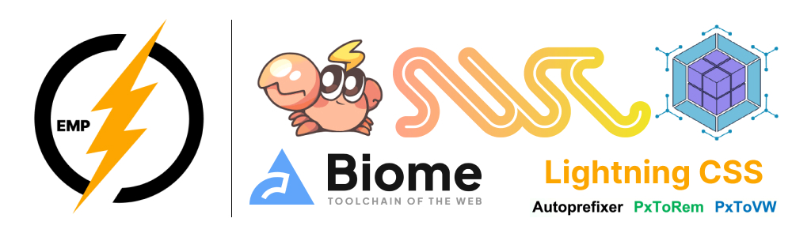

    

# EMP ⚡ 3.0
[![npm version][npm-version-src]][npm-version-href]
[![npm downloads][npm-downloads-src]][npm-downloads-href]
[![github][github-src]][github-href]
[![node][node-src]][node-href]

<b>下一代构建实现微前端 高性能解决方案、力争配置尽可能保持一致，开箱即用。</b>

+ 🔑 基于Rspack + Module Federation + Typescript、聚焦高性能 & 微前端
+ 🛠️ 多种开发需求、支持开箱即用。
+ 🔩 通用的插件、共享 webpackChain 插件接口。
+ 📦 **状态管理**：[@empjs/valtio](https://valtio.empjs.dev/) —— Valtio 增强版，更少样板、更强类型、内置历史与派生。

## 文档
+ 🚀 [快速开始](https://empjs.dev/guide/start/quick-start.html)
+ 🍭 [配置总览](https://empjs.dev/config/index.html)
+ 📦 [插件总览](https://empjs.dev/plugin/)
+ 📚 [交流区](https://github.com/empjs/emp/discussions/364)
+ 🎨 [官网Github](https://github.com/empjs/official)
+ 🎯 [工程初始化](https://github.com/empjs/create-emp)

## EMP Skills

本仓库内置 EMP 全栈技能，位于 `.cursor/skills/emp/`，内容已本地化，整合项目脚手架、emp.config、Tailwind v4、微前端 empRuntime、@empjs/valtio 状态管理、React 性能优化。

| 技能 | 路径 | 说明 |
|------|------|------|
| **emp** | `.cursor/skills/emp` | EMP 全栈：项目配置、插件、Tailwind、微前端、valtio、性能优化 |
| **emp-best-practices** | `.trae/skills/emp-best-practices` | EMP CLI 最佳实践、模块联邦、多框架互调、插件、性能 |

### 在 IDE / Agent 中的使用方式

- **Cursor**: 对话中引用 `@.cursor/skills/emp/SKILL.md`
- **Trae / OpenCode**: `.trae/skills/<name>/SKILL.md`
- **Claude**: `.claude/skills/<name>/SKILL.md`

在 Cursor 中引用 `@.cursor/skills/emp/SKILL.md`，即可让助手聚焦 EMP 全栈技能回答问题。

[npm-version-src]: https://img.shields.io/npm/v/@empjs/cli?style=flat&colorA=18181B&colorB=F0DB4F
[npm-version-href]: https://npmjs.com/package/@empjs/cli
[npm-downloads-src]: https://img.shields.io/npm/dm/@empjs/cli?style=flat&colorA=18181B&colorB=F0DB4F
[npm-downloads-href]: https://npmjs.com/package/@empjs/cli
[github-src]: https://img.shields.io/badge/github-@emp/cli-blue?style=flat&colorA=18181B&colorB=F0DB4F
[github-href]: https://github.com/empjs/emp
[node-src]: https://img.shields.io/node/v/@empjs/cli?style=flat&colorA=18181B&colorB=F0DB4F
[node-href]: https://nodejs.org/en/about/previous-releases

## QQ 交流群 

