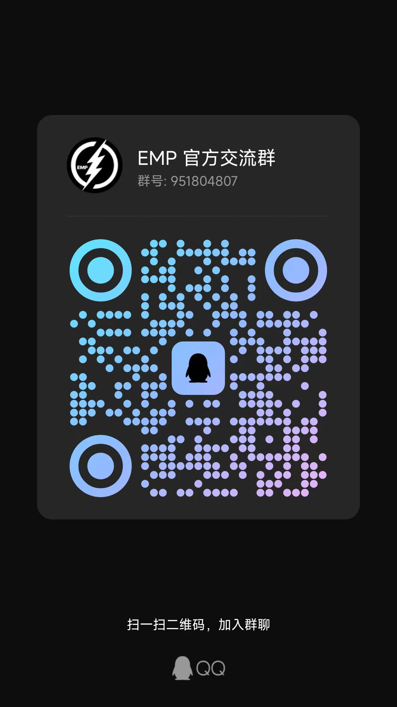

    

 

  
  

 

# EMP ⚡ 3.0
> 下一代构建实现微前端 高性能解决方案、力争配置尽可能保持一致，开箱即用。
+ 🔑 基于Rspack + Module Federation + Typescript、聚焦高性能 & 微前端
+ 🛠️ 多种开发需求、支持开箱即用。
+ 🔩 通用的插件、共享 webpackChain 插件接口.

## 提示 
+ 目前 v3 属于内测阶段，需要测试的可以使用 `npm i @empjs/cli` 安装，问题报障请加上 `v3` 的tag.
+ 关于 v3 想法的相关讨论 可以在 [v3讨论区](https://github.com/empjs/emp/discussions/364) 进行讨论。
+ 📦 插件总览 [点击查看](https://empjs.dev/plugin/)

## QQ交流群 

