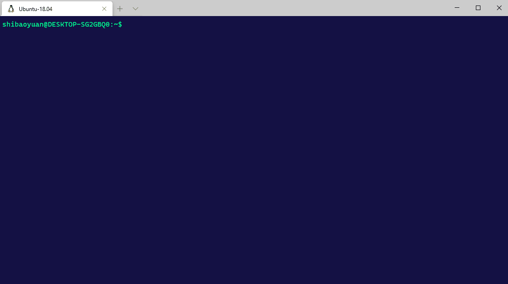
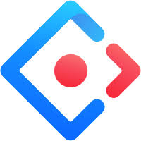
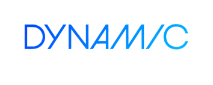

# EMP - Micro Frontends solution
> Base on Webpack 5 & Module Federation

English | [简体中文](./README-zh_CN.md)

## Projects
|Project|NPM|Info|
|---|---|---|
|[@efox/emp-cli](packages/emp-cli)|[](https://www.npmjs.com/package/@efox/emp-cli)|CLI|
|[@efox/emp-tsconfig](packages/emp-tsconfig)|[](https://www.npmjs.com/package/@efox/emp-tsconfig)|Typescript Config|
|[@efox/emp-tune-dts-plugin](packages/emp-tune-dts-plugin)|[](https://www.npmjs.com/package/@efox/emp-tune-dts-plugin)| Webpack Plugin for Module Federation Project in Typescript|
|[@efox/eslint-config-react-prittier-ts](packages/eslint-config-react-prittier-ts)|[](https://www.npmjs.com/package/@efox/eslint-config-react-prittier-ts)|ESLint Config|
|[@efox/emp-sync-vscode-plugin](https://github.com/efoxTeam/emp-sync-vscode-plugin)|[](https://marketplace.visualstudio.com/items?itemName=Benny.emp-sync-base)|EMP Type Synchronize VSCode Plugin|

## Quick Overview
```sh
npx @efox/emp-cli init
cd my-emp && yarn && yarn dev
```

+ If you've previously installed `@efox/emp-cli`,globally via `npm install -g @efox/emp-cli` or `yarn global add @efox/emp-cli `.  
+ we recommend you uninstall the package using `npm uninstall -g @efox/emp-cli` or `yarn global remove @efox/emp-cli` to ensure that npx always uses the latest version.

+ run `cd my-emp && yarn && yarn dev`,the project will automatically open in the browser.

+ If you want to know more about the use of `@efox/emp-cli`, go to [emp-cli](https://github.com/efoxTeam/emp/tree/main/packages/emp-cli).



## Framework Config Plugins
|Framework|NPM|demo|project|install|
|---|---|---|---|---|
|vue2|[](https://www.npmjs.com/package/@efox/emp-vue2)|[demo](projects/vue2)|[@efox/emp-vue2](packages/emp-frameworks/vue2)|`yarn add @efox/emp-vue2 -D`|
|vue3|[](https://www.npmjs.com/package/@efox/emp-vue3)|[demo](projects/vue3-base)|[@efox/emp-vue3](packages/emp-frameworks/vue3)|`yarn add @efox/emp-vue3 -D`|
|svelte|[](https://www.npmjs.com/package/@efox/emp-svetle)|[demo](projects/svelte)|[@efox/emp-svelte](packages/emp-frameworks/svelte)|`yarn add @efox/emp-svetle -D`|

## Demos
|Framework|demo|cli|
|---|---|---|
||[react-demo1](projects/demo1) [react-demo2](projects/demo2)|`cd projects && yarn dev`|
||[vue3-base](projects/vue3-base) [vue3-project](projects/vue3-project)|`cd projects && yarn dev:vue`|
||[vue2-base](projects/vue2-base) [vue2-project](projects/vue2-project)|`cd projects && yarn dev:vue2`|
||[antd-base](projects/antd-base) [antd-project](projects/antd-project1)|`cd projects && yarn dev:antd`|
||[https](projects/https)|`cd projects/https && yarn dev`|
||[dynamic-system-host](projects/dynamic-system-host)|`cd projects && yarn dev:dynamichost`|

## Use multiple frameworks in EMP Application
|Framework|demo|cli|
|---|---|---|
||[Vue use React](projects/reactVue-vue) & [React use Vue](projects/reactVue-react)|`cd projects && yarn dev:reactvue`|

## Show Case 
[EMP Awesome](https://github.com/efoxTeam/emp-Awesome)
