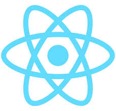
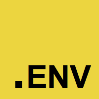

# EMP - Micro Frontends solution
> Base on Webpack 5 & Module Federation

English | [简体中文](./README-zh_CN.md) | [Discussions](https://github.com/efoxTeam/emp/discussions)

An implementation of [Micro Frontends](https://micro-frontends.org/), based on [Webpack5 Module Federation](https://webpack.js.org/concepts/module-federation/), but made it production-ready.

## 👨🏻‍💻 Table of contents
* [Projects](https://github.com/efoxTeam/emp#-projects)
* [Documentation](https://github.com/efoxTeam/emp#-documentation)
* [Quick Overview](https://github.com/efoxTeam/emp#-quick-overview)
* [Command plugin development guide](https://github.com/efoxTeam/emp#%EF%B8%8F-command-plugin-development-guide)
* [Framework Config Plugins](https://github.com/efoxTeam/emp#-framework-config-plugins)
* [EMP multi-frame intermodulation conversion plug-in](https://github.com/efoxTeam/emp#-emp-multi-frame-intermodulation-conversion-plug-in)
* [Demos](https://github.com/efoxTeam/emp#-demos)
* [Use multiple frameworks in EMP Application](https://github.com/efoxTeam/emp#-use-multiple-frameworks-in-emp-application)
* [Community](https://github.com/efoxTeam/emp#-community)


## 📦 Projects

|Project|NPM|Info|
|---|---|---|
|[@efox/emp-cli](packages/emp-cli)|[](https://www.npmjs.com/package/@efox/emp-cli)|CLI|
|[@efox/emp-tsconfig](packages/emp-tsconfig)|[](https://www.npmjs.com/package/@efox/emp-tsconfig)|Typescript Config|
|[@efox/emp-tune-dts-plugin](packages/emp-tune-dts-plugin)|[](https://www.npmjs.com/package/@efox/emp-tune-dts-plugin)| Webpack Plugin for Module Federation Project in Typescript|
|[@efox/eslint-config-react-prittier-ts](packages/eslint-config-react-prittier-ts)|[](https://www.npmjs.com/package/@efox/eslint-config-react-prittier-ts)|ESLint Config|
|[@efox/emp-sync-vscode-plugin](https://github.com/efoxTeam/emp-sync-vscode-plugin)|[](https://marketplace.visualstudio.com/items?itemName=Benny.emp-sync-base)|EMP Type Synchronize VSCode Plugin|

## 📖 Documentation

[https://github.com/efoxTeam/emp/wiki](https://github.com/efoxTeam/emp/wiki)

## 💿 Quick Overview
```sh
npx @efox/emp-cli init
cd my-emp && yarn && yarn dev
```

+ If you've previously installed `@efox/emp-cli`,globally via `npm install -g @efox/emp-cli` or `yarn global add @efox/emp-cli `.  
+ we recommend you uninstall the package using `npm uninstall -g @efox/emp-cli` or `yarn global remove @efox/emp-cli` to ensure that npx always uses the latest version.

+ run `cd my-emp && yarn && yarn dev`,the project will automatically open in the browser.

+ If you want to know more about the use of `@efox/emp-cli`, go to [emp-cli](https://github.com/efoxTeam/emp/tree/main/packages/emp-cli).


## 🧞‍♂️ Command plugin development guide

+ command - define the name of the command line command
+ description - description, it will be shown in help
+ option - Define parameters. It accepts four parameters. In the first parameter, it can enter the short name -a and the long name -app, separated by | or,. When used on the command line, these two are equivalent. The difference is The latter can be obtained through callbacks in the program; the second is the description, which will be displayed in the help message; the third parameter is the callback function, and the parameter it receives is a string. Sometimes we need a command line to create multiple Module, you need a callback to process; the fourth parameter is the default value
+ action - Register a callback function, here you need to pay attention to the current callback does not support let declaration variables

### plugin, the package name prefix needs to be `emp-plugin-*`, `cli.js` is the emp global plugin entry.

+ Create a new project with `emp-plugin-` as the project prefix, and the plugin entry is `cli.js`
```javascript
module.exports = program => {
  program
    .command('helloWorldPlugin')
    .option('-i, --item <item>')
    .description([
      `It is plugin description`,
    ])
    .action(({item}) => {
      console.log(`Plugin ${item}`)
    })
}
```

 + After the development is completed (emp-plugin-example is only the example package name, the specific package name is subject to the actual package name):
  + Install via `yarn`:
    + `yarn global add emp-plugin-example`
  + Install via `npm`:
    + `npm install emp-plugin-example -g`

 Start emp under the command to use the plugin<br>
 
<br>

## ✨ Framework Config Plugins
|Framework|NPM|demo|project|install|
|---|---|---|---|---|
|react|[](https://www.npmjs.com/package/@efox/emp-react)|[demo](projects/react)|[@efox/emp-react](packages/emp-frameworks/react)|`yarn add @efox/emp-react -D`|
|vue2|[](https://www.npmjs.com/package/@efox/emp-vue2)|[demo](projects/vue2)|[@efox/emp-vue2](packages/emp-frameworks/vue2)|`yarn add @efox/emp-vue2 -D`|
|vue3|[](https://www.npmjs.com/package/@efox/emp-vue3)|[demo](projects/vue3-base)|[@efox/emp-vue3](packages/emp-frameworks/vue3)|`yarn add @efox/emp-vue3 -D`|
|svelte|[](https://www.npmjs.com/package/@efox/emp-svetle)|[demo](projects/svelte)|[@efox/emp-svelte](packages/emp-frameworks/svelte)|`yarn add @efox/emp-svetle -D`|
|preact|[](https://www.npmjs.com/package/@efox/emp-preact)|[demo](projects/preact)|[@efox/emp-preact](packages/emp-frameworks/preact)|`yarn add @efox/emp-preact -D`|
|cocos2d|[](https://www.npmjs.com/package/@efox/emp-preact)|[demo](projects/cocos2d)|[@efox/emp-cocos2d](packages/emp-frameworks/cocos2d)|`yarn add @efox/emp-cocos2d -D`|

## ⚡ Compile
|Framework|NPM|demo|install|
|---|---|---|---|
|[emp-swc](https://swc.rs/)|[](https://www.npmjs.com/package/@efox/emp-vuett)|[plugin](packages/emp-compile/swc) [react-demo](projects/swc-react-ts)|`yarn add @efox/emp-swc`|

## ⚡ EMP multi-frame intermodulation conversion plug-in
|Framework|NPM|demo|install|
|---|---|---|---|
|emp-vue2-in-vue3|[](https://www.npmjs.com/package/@efox/emp-vuett)|[demo](projects/vue3-project)|`yarn add @efox/emp-vuett`|

## 📦 Demos
|Framework|demo|cli|
|---|---|---|
||[react-demo1](projects/demo1) [react-demo2](projects/demo2)|`cd projects && yarn dev`|
||[vue3-base](projects/vue3-base) [vue3-project](projects/vue3-project)|`cd projects && yarn dev:vue`|
||[vue2-base](projects/vue2-base) [vue2-project](projects/vue2-project)|`cd projects && yarn dev:vue2`|
||[antd-base](projects/antd-base) [antd-project](projects/antd-project1)|`cd projects && yarn dev:antd`|
||[preact-base](projects/preact-base) [preact-project](projects/preact-project)|`cd projects && yarn dev:preact`|
||[cocos2d-base](projects/cocos2d-base) [cocos2d-project](projects/cocos2d-project)|`cd projects && yarn dev:cocos2d`|
||[https](projects/https)|`cd projects/https && yarn dev`|
||[dynamic-system-host](projects/dynamic-system-host)|`cd projects && yarn dev:dynamichost`|
||[dotenv](projects/empty-project/.env.prod)|`cd projects/empty-project && yarn dev`|

## 💪 Use multiple frameworks in EMP Application
|Framework|demo|cli|
|---|---|---|
||[React 16](projects/react-diff16) & [React 17](projects/react-diff17)|`cd projects && yarn dev:reactdiff`|
||[Vue use React](projects/reactVue-vue) & [React use Vue](projects/reactVue-react)|`cd projects && yarn dev:reactvue`|
||[Vue3](projects/vue23-vue2) & [Vue2](projects/vue23-vue3)|`cd projects && yarn dev:vue23`|

## 👬 Community

* WeChat Group：


* WeChat Official Account： Efox


* Juejin： 

https://juejin.cn/user/483440843559406/posts

* oschina: 

https://my.oschina.net/u/568478

