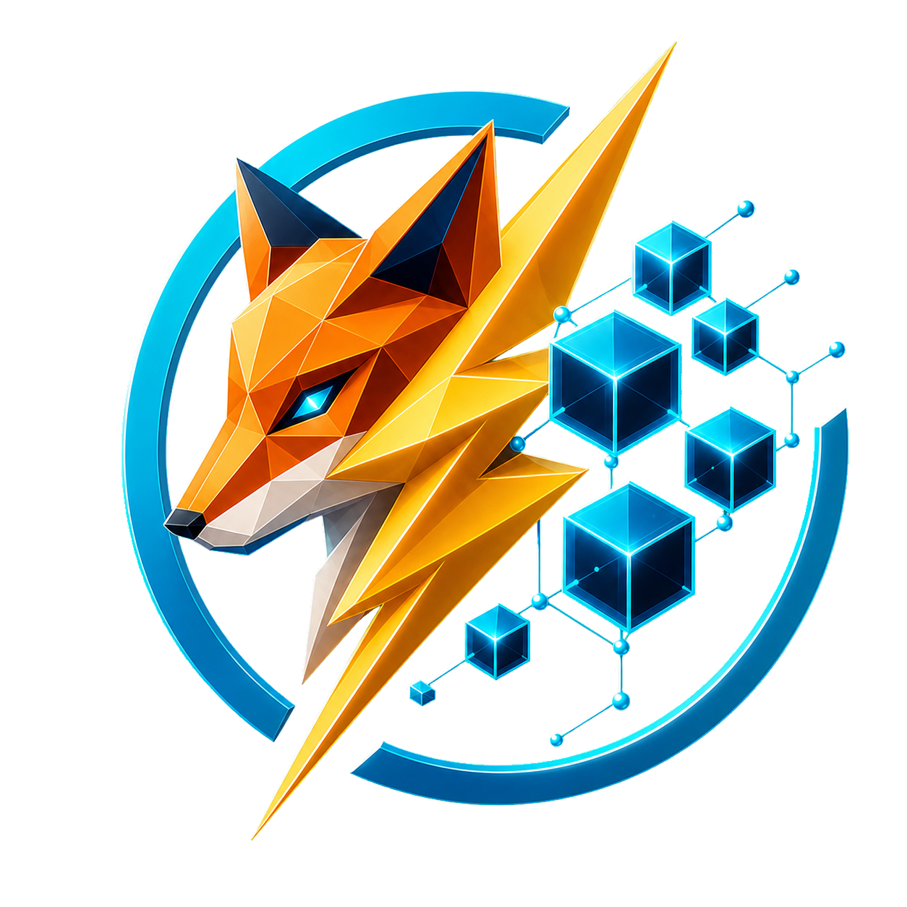
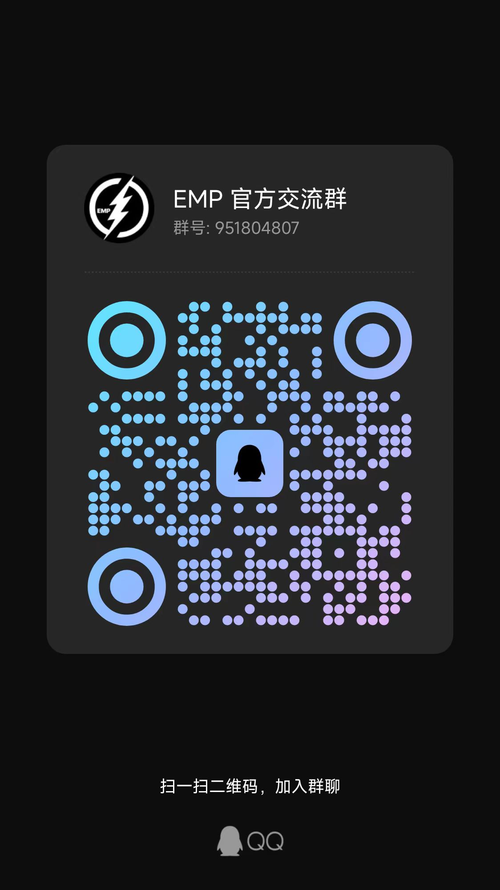

  

<h1 align="center">EMP v4 🦊</h1>

  <strong>高性能微前端联邦构建 · Rspack 2 · Module Federation 2 · ESM 输出 · TypeScript 7 stable</strong>

  
  
  
  
  
  

---

EMP 是一套面向现代 Web 的微前端工程工具：用统一配置完成 host、remote、shared、manifest、DTS 与运行时适配，让团队专注模块拆分与交付。⚡

## ✨ 核心能力

- **联邦构建**：内置 host、remote、共享依赖和类型声明生成。
- **高性能底座**：基于 Rspack 2，覆盖开发、构建、预览与分析。
- **ESM 优先输出**：支持 `build.useESM`、`modern-module` 与 `preserveModules`。
- **TS 7 稳定类型基线**：守住 CLI、插件、DTS 和样式类型兼容性。
- **框架生态**：开箱支持 React、Vue 2 / 3、Tailwind CSS、Lightning CSS 等。

## 🚀 为什么选择 EMP v4

- **更现代**：升级到 Module Federation 2，并保持熟悉的 EMP 配置体验。
- **更易迁移**：继续支持 `pluginRspackEmpShare(...)`，减少既有项目改造。
- **更易维护**：统一处理版本协商、单例依赖和运行时加载，减少重复配置。

## 📚 开始使用

快速开始和迁移步骤见 [EMP v4 迁移指南](docs/v4-migration.md)。EMP v4 正式版从 npm `latest` 安装。

顶部 badge 从 npm `latest` manifest 和 `main` 分支的 `packageManager` 字段动态读取，无需手写维护版本号。

## 💬 QQ 交流群

<!-- EMP Federation Fox: docs/assets/emp-federation-fox-full.png is used on the website hero. -->
