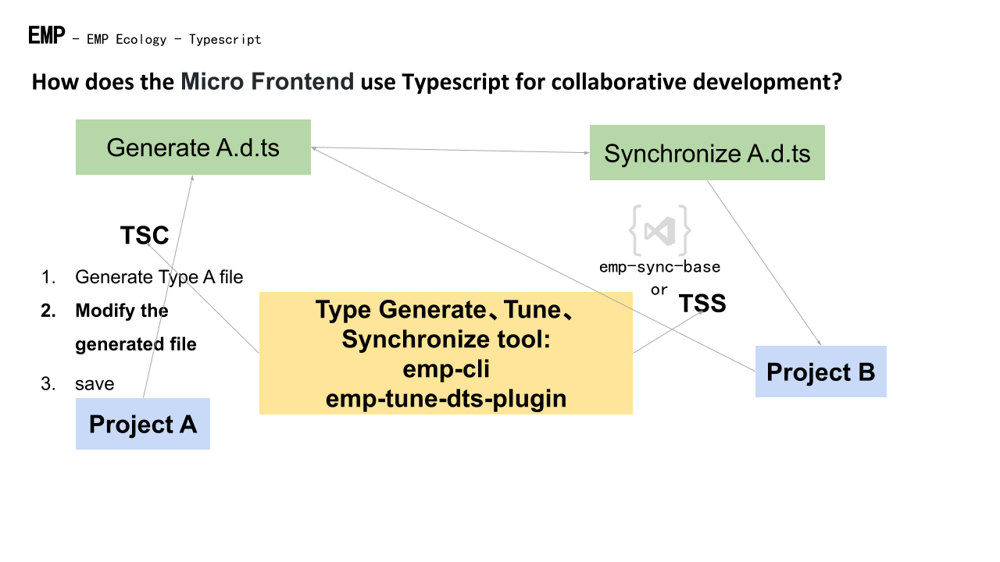

# @efox/emp-tune-dts-plugin

> Generate type files for Module Federation project

English | [简体中文](./README-zh_CN.md)

# 🧐 Why
+ In Typescript development, quoting remote project content requires type file support.
+ The module type generated by tsc is a relative path and cannot be used by remote projects.
+ Module Federation issues: [How typesafe can a remote be with Typescript?](https://github.com/module-federation/module-federation-examples/issues/20)

# ✨ Feature
+ Generate a d.ts file containing all types of the project
+ Type with current project name, not relative path
+ Form a closed loop of types, from generation to reference complete
+ Support custom modification

# 👨‍🔧 Architecture


## 📦 Quick start

`npm i @efox/emp-tune-dts-plugin` or `yarn add @efox/emp-tune-dts-plugin`

## 👨🏻‍💻 Use plugins on Webpack

```js
const { TuneDtsPlugin } = require('@efox/emp-tune-dts-plugin')
```

Way 1 recommended

```js
const createName = 'index.d.ts'
const createPath = './dist'
function operationDemo(fileData) {
  console.log(fileData)
  return fileData;
}
plugin.tunedts = {
  plugin: TuneDtsPlugin,
  args: [
      {
          output: path.join(createPath, createName),
          path: createPath,
          name: createName,
          isDefault:true,
          // Incoming function custom operation
          operation: operationDemo
        },
  ],
};
```

Way 2

```js
function operationDemo(fileData) {
  console.log(fileData)
  return fileData;
}
plugins: [
    new TuneDtsPlugin({
          output: path.join(createPath, createName),
          path: createPath,
          name: createName,
          isDefault:true,
          // Incoming function custom operation
          operation: operationDemo
        })
]
```

Parameter explanation:
| Parameter | Type | Explanation |
| ---- | ---- | --- |
| output| string (Required)| d.ts File output directory|
| path| string (Required)| d.ts Folder path|
| name| string (Required)| d.ts File name|
| isDefault | boolean(Required) | Replace relative paths with absolute paths by default |
| operation| Function (Optional)| Custom operation d.ts file function (when isDefault is true, operation will inherit the content after the default Replace). The input parameter is the content of the d.ts file, and the d.ts data must be returned after the operation is completed. operationDemo as an example|

## 💪 Generate

+ After connecting to the Webpack Plugin, run Webpack to generate the type file of the current Module Federation project and save it in dist

## 🔗 Remote reference
### Way 1
`yarn add @efox/emp-cli`

`yarn emp tss YourRemoteProjectAddress /index.d.ts -n YourRemoteProjectName.d.ts `

### Way 2
Use VSCode plugin： [emp-sync-base](https://marketplace.visualstudio.com/items?itemName=Benny.emp-sync-base)
