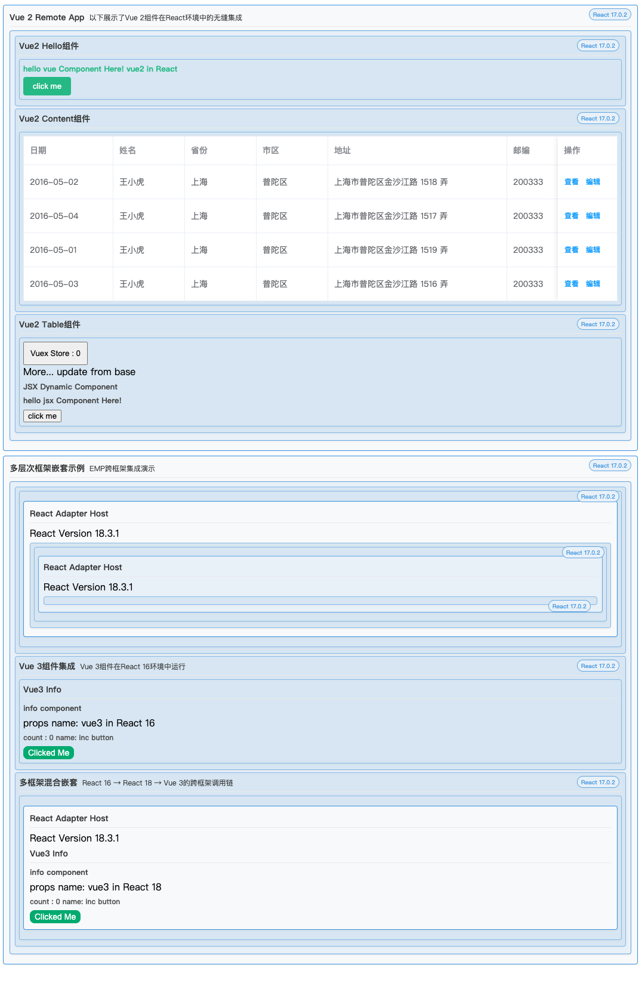

# EMP微前端实现Vue2、Vue3、React各版本调用方案

## 引言

在当今复杂多变的前端开发环境中，企业级应用往往面临着技术栈碎片化、团队协作效率低下以及系统迭代困难等挑战。微前端架构应运而生，而EMP作为一种创新的微前端解决方案，通过其卓越的跨端调用能力，为这些问题提供了优雅而高效的解决方案。本文将深入剖析EMP跨端集成的技术原理和实现机制。

## 源码

*   [demo](https://github.com/empjs/emp/tree/main/projects/adapter-app)
*   [bridge-react](https://github.com/empjs/emp/tree/main/packages/bridge-react)
*   [bridge-vue2](https://github.com/empjs/emp/tree/main/packages/bridge-vue2)
*   [bridge-vue3](https://github.com/empjs/emp/tree/main/packages/bridge-vue3)

## EMP跨端集成的技术架构

### 整体架构设计

EMP跨端集成的核心架构由以下几个关键部分组成：

1.  **Bridge层**：负责框架间的桥接，将不同框架的组件转换为统一的接口
2.  **Adapter层**：负责注入和管理不同版本的框架运行时
3.  **Runtime层**：处理不同框架的运行时加载和版本控制
4.  **通信层**：处理跨框架组件间的数据传递和事件通信

这种分层架构确保了各层职责明确，同时提供了足够的扩展性以支持更多框架的集成。

### Bridge层深度剖析

Bridge层是EMP跨端集成的核心，它解决了不同框架组件模型的差异问题。以`@empjs/bridge-vue2`为例，其内部实现原理如下：

```typescript
// bridge-vue2内部实现原理简化版
export function createBridgeComponent(Component, options) {
  const { Vue, plugin, instanceOptions = {} } = options;
  
  // 返回一个桥接提供者函数
  return function BridgeProvider(container, props) {
    let instance = null;
    
    // 创建Vue实例
    function create() {
      // 应用插件扩展Vue功能
      if (plugin && typeof plugin === 'function') {
        plugin(Vue);
      }
      
      // 创建Vue实例，注入store、router等
      instance = new Vue({
        ...instanceOptions,
        render: h => h(Component, { props }),
      }).$mount();
      
      // 将Vue组件挂载到React提供的DOM容器
      container.appendChild(instance.$el);
    }
    
    // 更新组件props
    function update(newProps) {
      if (instance && instance.$children[0]) {
        const vueComponent = instance.$children[0];
        // 更新props
        Object.keys(newProps).forEach(key => {
          vueComponent[key] = newProps[key];
        });
      }
    }
    
    // 销毁Vue实例
    function destroy() {
      if (instance) {
        instance.$destroy();
        if (container.contains(instance.$el)) {
          container.removeChild(instance.$el);
        }
        instance = null;
      }
    }
    
    // 返回组件生命周期控制接口
    return {
      create,
      update,
      destroy
    };
  };
}
```

这段代码揭示了Bridge层的核心工作原理：

1.  **统一生命周期接口**：将Vue组件的生命周期（创建、更新、销毁）转换为统一的接口
2.  **DOM挂载管理**：处理Vue组件在React容器中的挂载和卸载
3.  **Props传递**：确保React传递的props能正确更新到Vue组件
4.  **插件系统**：支持通过plugin扩展Vue功能
5.  **实例选项注入**：通过instanceOptions支持注入store、router等Vue实例选项

## 跨框架通信的深层次挑战与解决方案

### 生命周期协调问题

不同框架的生命周期模型存在显著差异，例如：

*   React使用类组件的`componentDidMount`/`componentWillUnmount`或函数组件的`useEffect`
*   Vue 2使用`mounted`/`destroyed`钩子
*   Vue 3使用`setup`函数和组合式API

EMP通过以下策略解决生命周期协调问题：

1.  **统一生命周期抽象**：将不同框架的生命周期抽象为`create`/`update`/`destroy`三个核心方法
2.  **事件同步**：确保父框架的生命周期事件能正确触发子框架组件的相应生命周期
3.  **资源清理**：在组件卸载时彻底清理所有资源，防止内存泄漏

### 渲染模型差异

React和Vue的渲染模型有本质区别：

*   React使用虚拟DOM和单向数据流
*   Vue使用响应式系统和双向绑定

EMP通过以下机制处理渲染模型差异：

```typescript
// React组件中使用Vue组件的渲染流程
class ReactWrapper extends React.Component {
  containerRef = React.createRef();
  bridgeInstance = null;
  
  componentDidMount() {
    // 创建桥接实例
    this.bridgeInstance = this.props.bridgeProvider(
      this.containerRef.current,
      this.props
    );
    // 调用create方法挂载Vue组件
    this.bridgeInstance.create();
  }
  
  componentDidUpdate(prevProps) {
    // 当props变化时，调用update方法更新Vue组件
    if (this.bridgeInstance && this.props !== prevProps) {
      this.bridgeInstance.update(this.props);
    }
  }
  
  componentWillUnmount() {
    // 组件卸载时，调用destroy方法销毁Vue组件
    if (this.bridgeInstance) {
      this.bridgeInstance.destroy();
      this.bridgeInstance = null;
    }
  }
  
  render() {
    // 创建一个DOM容器用于挂载Vue组件
    return <div ref={this.containerRef} />;
  }
}
```

这种实现方式解决了以下问题：

1.  **渲染时机同步**：确保Vue组件在React生命周期的正确时机渲染和更新
2.  **属性变更检测**：React的props变化会触发Vue组件的更新
3.  **DOM管理**：为Vue组件提供独立的DOM容器，避免React和Vue的DOM操作冲突

### 状态管理与数据流

跨框架组件间的状态共享是一个复杂问题。EMP采用以下策略：

1.  **Props单向传递**：主要通过props从父组件向子组件传递数据
2.  **事件回调**：通过回调函数从子组件向父组件传递事件和数据
3.  **全局状态注入**：通过instanceOptions注入store等全局状态管理工具

```typescript
// Vue组件中的状态管理
const BridgeComponent = createBridgeComponent(VueComponent, {
  Vue,
  instanceOptions: {
    // 注入Vuex store
    store: new Vuex.Store({
      state: { /* ... */ },
      mutations: { /* ... */ },
      actions: { /* ... */ }
    })
  }
});

// React组件中的状态传递
function ReactComponent() {
  const [data, setData] = useState(initialData);
  
  const handleEvent = (eventData) => {
    // 处理从Vue组件传回的事件数据
    setData(eventData);
  };
  
  return (
    <VueComponent 
      data={data}
      onEvent={handleEvent}
    />
  );
}
```

### 性能优化策略

跨框架调用不可避免地会带来一定的性能开销。EMP通过以下策略优化性能：

1.  **最小化渲染次数**：避免不必要的更新传递
2.  **延迟加载**：按需加载框架运行时和组件
3.  **共享运行时**：相同框架的组件共享一个运行时实例
4.  **内存管理**：及时清理不再使用的组件和事件监听器

## 实际应用中的技术挑战与解决方案

### 错误边界处理

跨框架调用增加了错误处理的复杂性。EMP实现了多层次的错误处理机制：

```typescript
// React错误边界组件
class ErrorBoundary extends React.Component {
  state = { hasError: false, error: null };
  
  static getDerivedStateFromError(error) {
    return { hasError: true, error };
  }
  
  componentDidCatch(error, errorInfo) {
    // 记录错误信息
    console.error('Cross-framework component error:', error, errorInfo);
  }
  
  render() {
    if (this.state.hasError) {
      // 渲染错误UI
      return <div className="error-container">组件加载失败</div>;
    }
    return this.props.children;
  }
}

// 使用错误边界包装跨框架组件
function SafeComponent() {
  return (
    <ErrorBoundary>
      <RemoteVueComponent />
    </ErrorBoundary>
  );
}
```

# EMP 跨框架组件集成

> EMP 微前端框架中实现跨框架组件集成，特别是如何在 React 17 应用中使用 React 18、Vue 2 和 Vue 3 组件。



## 1. 项目设置和依赖安装

首先，我们需要设置一个基于 EMP 框架的 React 17 项目，并安装必要的依赖。

### 创建项目

使用 EMP CLI 创建一个新项目：

```bash
# 安装 EMP CLI
npm install -g @empjs/cli

# 创建项目
emp create my-cross-framework-app
cd my-cross-framework-app
```

### 安装必要依赖

在 `package.json` 中添加以下依赖：

```json
{
  "dependencies": {
    "@empjs/bridge-react": "^latest",
    "@empjs/bridge-vue2": "^latest",
    "@empjs/bridge-vue3": "^latest",
    "@empjs/share": "^latest",
    "react": "17",
    "react-dom": "17"
  },
  "devDependencies": {
    "@empjs/cli": "^latest",
    "@empjs/plugin-react": "^latest",
    "@types/react": "17",
    "@types/react-dom": "17"
  }
}
```

然后运行：

```bash
npm install
# 或
yarn
# 或
pnpm install
```

## 2. 配置 EMP 项目

创建或修改 `emp.config.ts` 文件，配置远程应用和运行时适配器：

```typescript
import {defineConfig} from '@empjs/cli'
import pluginReact from '@empjs/plugin-react'
import {pluginRspackEmpShare} from '@empjs/share'

export default defineConfig(store => {
  const ip = store.server.ip
  const port = 7702
  return {
    plugins: [
      pluginReact(),
      pluginRspackEmpShare({
        name: 'myApp',
        exposes: {},
        experiments: {
          asyncStartup: true,
        },
        remotes: {
          // React 18 远程应用
          react18App: `react18App@http://${ip}:7701/emp.json`,
          // Vue 3 远程应用
          vue3App: `vue3App@http://${ip}:9901/emp.json`,
          // Vue 2 远程应用
          vue2App: `vue2App@http://${ip}:9902/emp.json`,
        },
        empRuntime: {
          framework: {
            global: 'EMP_ADAPTER_REACT',
            libs: [
              // React 18 适配器
              `https://unpkg.com/@empjs/cdn-react@0.18.0/dist/reactRouter.${store.mode}.umd.js`,
              // Vue 3 + Router + Pinia 适配器
              `https://unpkg.com/@empjs/cdn-vue-router-pinia@3.5.0/dist/vueRouter.${store.mode}.umd.js`,
              // Vue 2 适配器
              `https://unpkg.com/@empjs/cdn-vue@0.2.1/dist/vueRouter.${store.mode}.umd.js`,
            ],
          },
          runtime: {
            lib: `https://unpkg.com/@empjs/share@3.10.1/output/sdk.js`,
          },
        },
      }),
    ],
    server: {
      port,
      open: false,
    },
  }
})
```

## 3. 创建适配器组件

### React 18 适配器

创建 `src/adapter/React18.ts` 文件：

```typescript
import {createBridgeComponent, createRemoteAppComponent} from '@empjs/bridge-react'
import React18App from 'react18App/App'
// React 17 组件
import React from 'react'

// 从全局对象获取 React 18 适配器
const {EMP_ADAPTER_REACT} = window as any

// 创建桥接组件
const BridgeComponent = createBridgeComponent(React18App, EMP_ADAPTER_REACT)

// 导出可在 React 17 中使用的 React 18 组件
export const Remote18App = createRemoteAppComponent(BridgeComponent, {React})
```

### Vue 3 适配器

创建 `src/adapter/Vue3.ts` 文件：

```typescript
import {createRemoteAppComponent} from '@empjs/bridge-react'
import {createBridgeComponent} from '@empjs/bridge-vue3'
// React 17 组件
import React from 'react'
import Vue3App from 'vue3App/Info'

// 从全局对象获取 Vue 3 适配器
const {EMP_ADAPTER_VUE} = window as any
const {Vue, Pinia} = EMP_ADAPTER_VUE

// 创建桥接组件
const BridgeComponent = createBridgeComponent(Vue3App, {
  Vue,
  plugin: app => {
    const pinia = Pinia.createPinia()
    app.use(pinia)
  },
})

// 导出可在 React 17 中使用的 Vue 3 组件
export const RemoteVue3App = createRemoteAppComponent(BridgeComponent, {React})
```

### Vue 2 适配器

创建 `src/adapter/Vue2.ts` 文件：

```typescript
import {createRemoteAppComponent} from '@empjs/bridge-react'
import {createBridgeComponent} from '@empjs/bridge-vue2'
// React 17 组件
import React from 'react'
import Vue2App from 'vue2App/Info'

// 从全局对象获取 Vue 2 适配器
const {EMP_ADAPTER_VUE_v2} = window as any
const {Vue} = EMP_ADAPTER_VUE_v2

// 创建桥接组件
const BridgeComponent = createBridgeComponent(Vue2App, {Vue})

// 导出可在 React 17 中使用的 Vue 2 组件
export const RemoteVue2App = createRemoteAppComponent(BridgeComponent, {React})
```

## 4. 在主应用中使用远程组件

创建或修改 `src/App.tsx` 文件：

```tsx
import React from 'react'
import {Remote18App} from './adapter/React18'
import {RemoteVue2App} from './adapter/Vue2'
import {RemoteVue3App} from './adapter/Vue3'
import {Box, ReactInfo} from './components/Info'

const App = () => (
  <div>
    {/* 使用 Vue 2 组件 */}
    <Box>
      <h1>Vue 2 Remote App</h1>
      <RemoteVue2App name="vue2 in React" />
    </Box>
    
    <ReactInfo desc="ReactInfo">
      {/* 使用 React 18 组件 */}
      <Remote18App>
        <ReactInfo desc="ReactInfo in Remote18App">
          <Remote18App>
            <ReactInfo desc="last component " />
          </Remote18App>
        </ReactInfo>
      </Remote18App>
      
      {/* 使用 Vue 3 组件 */}
      <Box>
        <h2>Vue3 Component</h2>
        <RemoteVue3App name="vue3 in React 16" />
      </Box>
      
      {/* 在 React 18 组件中嵌套 Vue 3 组件 */}
      <Remote18App>
        <RemoteVue3App name="vue3 in React 18" />
      </Remote18App>
    </ReactInfo>
  </div>
)

export default App
```

## 5. 添加热更新支持

为了支持 Vue 2 组件的热更新，需要在 `src/bootstrap.tsx` 中添加：

```tsx
import React from 'react'
import ReactDOM from 'react-dom'
import App from './App'

ReactDOM.render(React.createElement(App), document.getElementById('emp-root'))

// 只在热更新时加载 vue-2-hmr 模块
if ((module as any).hot) {
  console.log('vue-2-hmr', module)
  import('src/adapter/vue-2-hmr')
}
```

创建 `src/adapter/vue-2-hmr.ts` 文件：

```typescript
// 预加载 Vue 2 组件以支持热更新
import 'vue2App/Info'
```

## 6. 工作原理解析

### React 17 调用 React 18 的机制

1.  **桥接层**：使用 `@empjs/bridge-react` 创建桥接组件，它负责处理不同 React 版本之间的通信。

2.  **适配器注入**：通过全局对象 `EMP_ADAPTER_REACT` 注入 React 18 的实例，这是由 EMP 运行时提供的。

3.  **组件包装**：`createRemoteAppComponent` 函数将远程 React 18 组件包装成可在 React 17 中使用的组件。

### React 与 Vue 集成的机制

1.  **Vue 桥接**：使用 `@empjs/bridge-vue2` 或 `@empjs/bridge-vue3` 创建 Vue 桥接组件。

2.  **适配器注入**：通过全局对象 `EMP_ADAPTER_VUE` 或 `EMP_ADAPTER_VUE_v2` 注入 Vue 实例。

3.  **React 包装**：使用 `createRemoteAppComponent` 将 Vue 桥接组件包装成 React 组件。

4.  **插件支持**：Vue 3 适配器支持通过 `plugin` 选项添加 Pinia 等插件。

## 7. 运行项目

启动开发服务器：

```bash
npm run dev
# 或
yarn dev
# 或
pnpm dev
```

访问 `http://localhost:7702` 查看应用。

## 8. 最佳实践

1.  **错误边界**：使用 React 的 ErrorBoundary 组件捕获远程组件加载失败的错误。

2.  **懒加载**：对于不是立即需要的远程组件，考虑使用 React.lazy 和 Suspense 进行懒加载。

3.  **版本管理**：确保远程应用的版本与适配器版本兼容。

4.  **性能优化**：避免过多的跨框架组件嵌套，这可能导致性能问题。

5.  **状态管理**：跨框架组件之间的状态共享应通过 props 传递，避免使用框架特定的状态管理工具。

## 总结

通过 EMP 框架的适配器和桥接工具，我们可以在 React 17 应用中无缝集成 React 18、Vue 2 和 Vue 3 组件。这种方法使得不同框架和版本的组件可以共存，为微前端架构提供了强大的支持。

这种集成方式特别适用于以下场景：

*   逐步升级大型应用的框架版本
*   在现有项目中复用不同框架的组件
*   构建由多个团队维护的微前端应用

通过遵循本教程，您可以构建一个跨框架、跨版本的现代前端应用，充分利用不同框架的优势。
